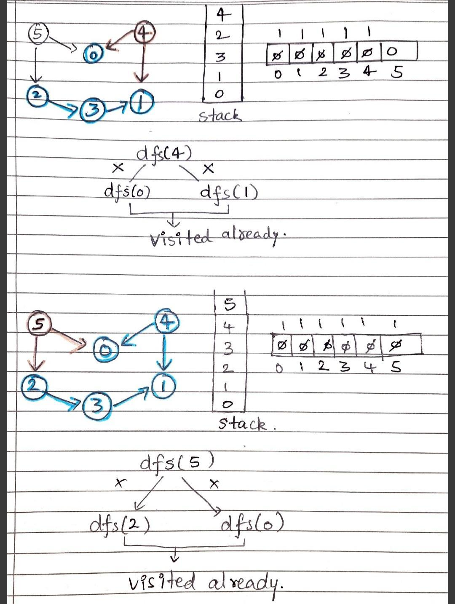
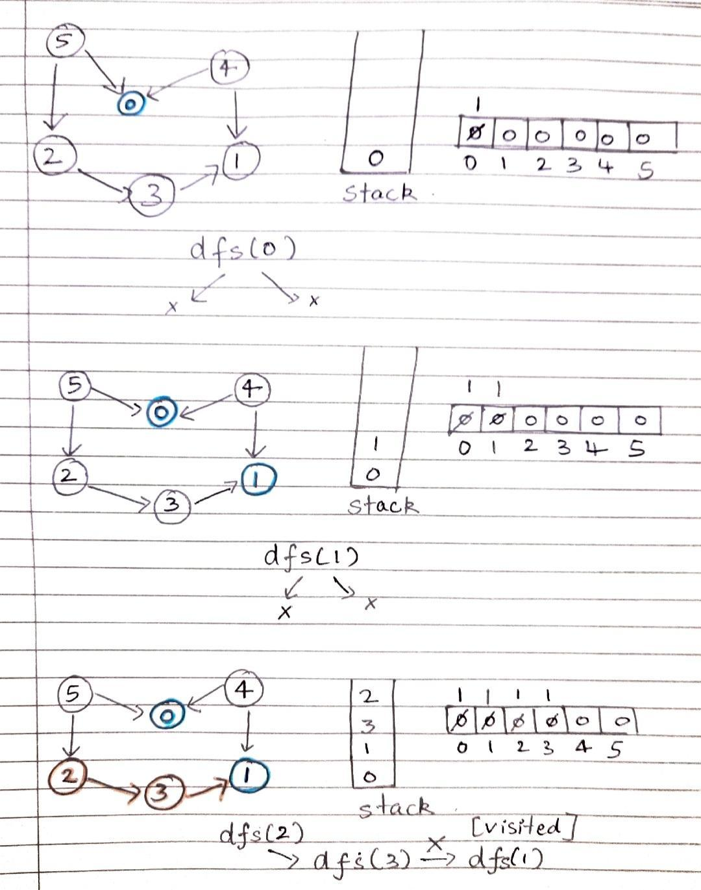
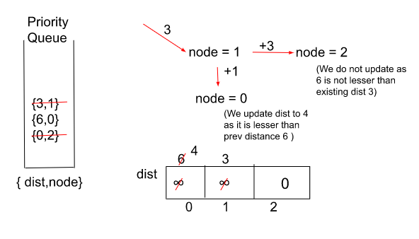
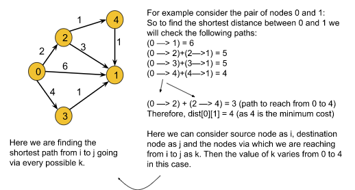
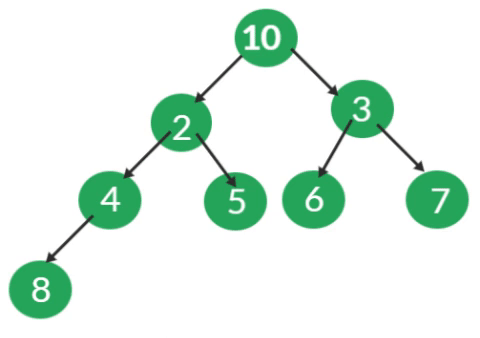
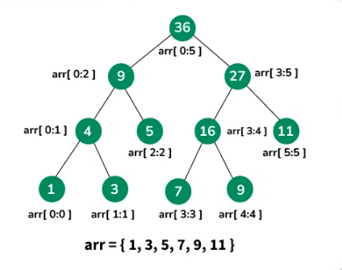

## Course Information
**Course Name:** Algorithmic Problem Solving  
**Course Code:** 23ECSE309  
**Student Name:** Girish Tammanagoudar

**SRN:** 01fe21bcs256  
**Course Instructor:** Prakash Hegade  
**University:** KLE Technological University

## List of Contents
1. [Introduction](# Introduction)
2. [Objectives](# Objectives)
3. [Business Applications](# Business Application)
4. [Codes](# Codes)
5. [Conclusion](# Conclusion)
6. [References](# References )
## Introduction
Developing a portfolio project centered on a ride-sharing application like Ola or Uber showcases our skills in data structures and algorithms (DSA). These applications require efficient algorithms for tasks such as matching riders with drivers, optimizing routes, managing dynamic pricing, and tracking real-time locations. By implementing key DSA techniques, including graph algorithms, priority queues, and spatial indexing, you can demonstrate your ability to tackle complex, real-world problems with efficient and scalable solutions. 

## Objectives
1. Develop an algorithm to match riders with the nearest available drivers in real-time using priority queues.
2. Implement shortest path algorithms like Dijkstra’s or A* to optimize routes for drivers, reducing travel time and fuel consumption.
3. Create a dynamic pricing model that adjusts ride costs based on supply and demand, utilizing greedy algorithms or machine learning techniques.
4. Design a system to continuously update and track the location of vehicles using spatial data structures like quad trees.
5. Develop a scheduling algorithm that minimizes wait times for riders and maximizes driver efficiency using job scheduling techniques.
6. Implement efficient data structures, such as hash tables and balanced trees, to manage user and driver profiles, ratings, and feedback.
7. Ensure the system can handle high volumes of requests and scale effectively with increasing user base by optimizing data structures and algorithms.
8. Implement secure methods for data storage and communication to protect user and driver information.

## Business Applications
1. Scheduling driver tasks such as vehicle maintenance, rest periods, and shifts in a specific order. 
2. Ensuring new features or updates are deployed in the correct sequence to avoid dependencies issues. 
3. Finding the shortest path for drivers to pick up passengers and reach destinations, minimizing travel time and fuel consumption. 
4. Providing real-time navigation guidance to drivers, helping them avoid traffic and reach destinations faster. 
5. Adjusting routes dynamically in response to traffic changes or roadblocks, ensuring the quickest route is always taken. 
6. Pre-computing shortest paths between all popular pick-up and drop-off points to quickly provide estimated times of arrival (ETAs) to users. 
7. Optimizing routes for drivers who have multiple drop-off points in a single trip, ensuring the shortest overall route. 
8. Efficiently managing the queue of available drivers and matching them with riders based on proximity and other factors. 
9. Managing priority tasks such as high-demand ride requests or emergency situations. 
10. Deciding the best set of drivers and vehicles to deploy in high-demand areas to maximize efficiency and profits. 
11. Efficiently handling dynamic pricing adjustments based on real-time supply and demand, time of day, and other factors. 
12. Managing and querying driver availability in different regions dynamically as new requests come in. 
13. Optimizing the allocation of drivers based on various constraints (e.g., driver availability, vehicle capacity) to maximize ride fulfillment. 
14. Providing more efficient route planning for drivers by considering both the shortest path and real-time traffic conditions. 

## Codes
### Topological Sorting
Topological sorting can be utilized to effectively manage dependencies within a ride-sharing system, ensuring that specific tasks are completed in a predetermined order. For instance, it can be applied to schedule drivers based on a sequence of tasks such as vehicle maintenance, rest periods, and shift changes, optimizing operational efficiency and compliance. This approach ensures that necessary prerequisites are met before subsequent tasks are initiated, reducing downtime and enhancing service reliability. Additionally, topological sorting can be crucial for managing feature rollouts within the platform, ensuring updates are deployed in the correct sequence to avoid dependency issues. 
[Click here to view the implementation](toposort.cpp)  

Time Complexity: O(N+E) 
N = Number of node , E = Number of Edges
Space Complexity: O(N) + O(N)
Visited Array and Stack data structure. Both will be using O(N).
Auxiliary Space Complexity:  O(N)

### Dijkstra's Algorithm
Dijkstra's algorithm is essential for finding the shortest path between two points, making it a key component for route optimization in ride-sharing services. In a platform like Ola or Uber, this algorithm helps drivers navigate the most efficient routes to pick up and drop off passengers, minimizing travel time and fuel consumption. By calculating the shortest paths, drivers can avoid traffic congestion and reduce overall journey times. Additionally, Dijkstra's algorithm supports real-time navigation, providing dynamic route updates to adapt to changing traffic conditions. This enhances the overall user experience by ensuring timely arrivals and departures. Implementing Dijkstra's algorithm thus plays a crucial role in improving operational efficiency and customer satisfaction in ride-sharing applications.
[Click here to view the implementation](djikstrals.cpp)  

Time Complexity: O( E log(V) ), Where E = Number of edges and V = Number of Nodes.
Space Complexity: O( |E| + |V| ), Where E = Number of edges and V = Number of Nodes.

### A Search Algorithm*
A* Search Algorithm, an advanced version of Dijkstra's, offers faster route finding by incorporating heuristics to estimate the remaining cost to the destination. This makes it more efficient for real-time navigation in ride-sharing services like Ola or Uber, where quick and accurate route adjustments are crucial. By considering both the shortest path and real-time traffic conditions, A* Search Algorithm ensures drivers can navigate around obstacles and congestion more effectively. This leads to reduced travel times, improved fuel efficiency, and enhanced overall user satisfaction compared to using Dijkstra's algorithm alone.
[Click here to view the implementation](A*search.cpp)  

Time Complexity: Considering a graph, it may take us to travel all the edge to reach the destination cell from the source cell [For example, consider a graph where source and destination nodes are connected by a series of edges, like – 0(source) –>1 –> 2 –> 3 (target). So the worse case time complexity is O(E), where E is the number of edges in the graph
Auxiliary Space: In the worse case we can have all the edges inside the open list, so required auxiliary space in worst case is O(V), where V is the total number of vertices.  

#### Difference between Djikstra's and A* Search
<html lang="en">
<head>
    <meta charset="UTF-8">
    <meta name="viewport" content="width=device-width, initial-scale=1.0">
    <title>Document</title>
</head>
<body>
    <table style="border:1px solid black">
        <tr>
        <th>Characteristics</th>
        <th>Djikstrals</th>
        <th>A* search</th>
    </tr>
        <tr>
            <td>Algorithm type</td>
            <td>Greedy</td>
            <td>Informed Search(uses heuristics)</td>
        </tr>
        <tr>
            <td>Initialization</td>
            <td>Tentative distance: 0 for source, infinity for others</td>
            <td>Tentative distance and heuristic function</td>
        </tr>
        <tr>
            <td>Algorithm type</td>
            <td>Greedy</td>
            <td>Informed Search(uses heuristics)</td>
        </tr>
        <tr>
            <td>Heuristic Use</td>
            <td>None</td>
            <td>Uses heuristic to estimate remaining cost to goal</td>
        </tr>
        <tr>
            <td>Algorithm type</td>
            <td>Greedy</td>
            <td>Informed Search(uses heuristics)</td>
        </tr>
        <tr>
            <td>Efficiency</td>
            <td>Less efficient for large graphs</td>
            <td>More efficient with a well-chosen heuristic</td>
        </tr>
        <tr>
            <td>Complexity</td>
            <td>O(V^2) or O((V + E) log V) with priority queue</td>
            <td>Depends on heuristic; typically better than Dijkstra’s</td>
        </tr>
        <tr>
            <td>Strengths</td>
            <td>Guarantees shortest path for all nodes</td>
            <td>Efficient pathfinding with good heuristic</td>
        </tr>
         <tr>
            <td>Weaknesses</td>
            <td>Can be slow for large graphs</td>
            <td>Performance depends on heuristic quality</td>
        </tr>
    </table>
</body>
    
</html>

### Floyd Worshall
The Floyd-Warshall algorithm is ideal for pre-computing shortest paths between all pairs of nodes, making it invaluable for ride-sharing services. By calculating the shortest paths between popular pick-up and drop-off points, it allows for quick estimation of times of arrival (ETAs) for users. Additionally, this algorithm is crucial for optimizing routes for drivers with multiple drop-off points in a single trip, ensuring the shortest overall route. This enhances operational efficiency and provides a smoother user experience by minimizing travel times and improving route planning. 
[Click here to view implementation](FloydWorshall.cpp)  

Time Complexity: O(V^3), as we have three nested loops each running for V times, where V = no. of vertices.
Space Complexity: O(V^2), where V = no. of vertices. This space complexity is due to storing the adjacency matrix of the given graph.  

### Binary heap
Binary heaps are essential for efficiently managing priority queues in ride-sharing services. They are particularly useful for managing the queue of available drivers and matching them with riders based on proximity and other factors, ensuring quick and efficient rides. Additionally, binary heaps play a crucial role in handling priority tasks, such as high-demand ride requests or emergency situations, by prioritizing these tasks and assigning drivers promptly. This ensures that the most urgent requests are addressed swiftly, enhancing overall service reliability and user satisfaction.
[Click here to view implementation](BinaryHeap.cpp)
Time Complexities:
<html lang="en">
<head>
    <meta charset="UTF-8">
    <meta name="viewport" content="width=device-width, initial-scale=1.0">
    <title>Document</title>
</head>
<body>
    <table style="border:1px solid black">
        <tr>
        <th>Function</th>
        <th>Time Complexity</th>
    </tr>
        <tr>
            <td>Insert():</td>
            <td>O(logN)</td>
        </tr>
        <tr>
            <td>Heapify():</td>
            <td>O(logN)</td>
        </tr>
        <tr>
            <td>getMin():</td>
            <td>O(1)</td>
        </tr>
        <tr>
            <td>ExtractMin():</td>
            <td>O(logN)</td>
        </tr>
        <tr>
            <td>Decreasekey():</td>
            <td>O(logN)</td>
        </tr>
        <tr>
            <td>Delete():</td>
            <td>O(logN)</td>
        </tr>
    </table>
</body>
</html> 

### Knapsack Problem
The Knapsack Problem is crucial for optimizing resource allocation in ride-sharing services. It helps in deciding the best set of drivers and vehicles to deploy in high-demand areas, taking into account various constraints such as driver availability and vehicle capacity. By using this algorithm, ride-sharing companies can maximize ride fulfillment and operational efficiency. Additionally, it aids in fleet management by ensuring that the most suitable drivers and vehicles are strategically positioned to meet demand, thereby enhancing overall service profitability and effectiveness.
[Click here to view implementation](Knapsack.cpp)
Time Complexity: O(N*W)
Reason: There are two nested loops
Space Complexity: O(N*W)
Reason: We are using an external array of size ‘N*W’. Stack Space is eliminated.

### Segment Trees
Segment trees are essential for efficiently managing dynamic ride pricing and availability queries in ride-sharing services. They handle dynamic pricing adjustments by quickly responding to changes in real-time supply and demand, time of day, and other factors, ensuring accurate fare calculations. Additionally, segment trees facilitate the management of driver availability across various regions, allowing for quick updates and queries as new requests come in. This ensures that the most relevant and timely information is available to optimize service efficiency and customer satisfaction. 
[Click here to view implementation](SegmentTrees.cpp) 

Time Complexities:
a) Tree Construction: O( n )
b) Query in Range: O( Log N)
c) Updating an element: O(Log n). 
Auxiliary Space: O(2*N) 

### Conclusion
This portfolio demonstrates a robust understanding of data structures and algorithms through practical applications in a ride-sharing context. By tackling real-world problems such as rider-driver matching, route optimization, dynamic pricing, and vehicle tracking, the project highlights the ability to design and implement efficient, scalable, and secure solutions. Each algorithm and data structure has been carefully selected and applied to address specific challenges inherent in ride-sharing applications, reflecting a strong grasp of both theoretical concepts and their practical implications. 

### References
1. TakeUforward ‘Topo Sort Implementation’ 
2. GeeksforGeeks ‘A* Search Algorithm’
3. TakeUforward ‘Djikstras Algorithm’
4. TakeUforward ‘Binary Heap’
5. Fu Mengyin, Li Ji and Deng Zhihong, "A Hierarchical Route Planning Algorithm with Restricted Search Area", Journal of Computer-Aided Design & Computer Graphics, vol. 17, no. 8, pp. 1773-1777, 2005.
6. GeeksforGeeks ‘Segment Trees Implementation’.
7.  Bellman, R., “Some Applications of the Theory of Dynamic Programming—A Review,” Operations Research 2, 275–288 (1954).
